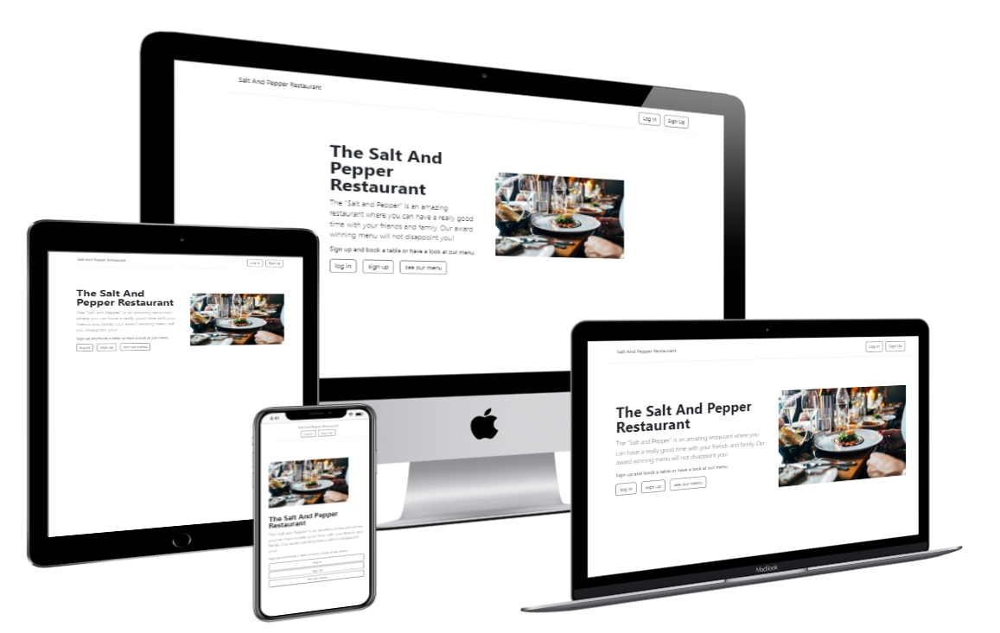
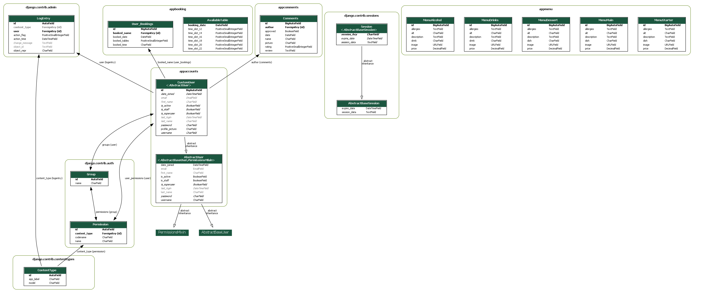

The side allows the owner to easily manage their restaurant and engage with his customers.  

**The guests** can sign up for a free account to create and amend their reservations (**C**reate, **R**ead, **U**pdate, **D**elete). To keep them engaged, they also can upload their profile pictures, and write comments about the restaurant's service. Which can be viewed on the landing page, after it has been approved by the administrator.  

**The administrator** itself can easily update the menu from the admin side with pictures, prices, allergies, and descriptions.  

*Click on the link to the* [Salt and Pepper](https://salt-and-pepper-manager.herokuapp.com/) *live website*

---

## Overview

1. [features](#1-features)
2. [technology's](#2-technologys)
3. [development](#3-development)
4. [relational database model](#4-relational-database-model)
5. [testing](#5-testing)
6. [deployment](#6-deployment)
7. [credits](#7-credits)

---

[back to overview](#overview)

## 1. Features

### Main Features

#### 1. table reservation :

- the user can from within the app ...
  - **C**reate a table reservation
  - **R**ead his/her table reservation
  - **U**pdate a table reservation
  - **D**elete his/her table reservation  
  
  *Click on the link to see a demonstration of the feature:* [reserving a table](assets/doc/images/booking_table_600.gif)

#### 2. menu creation :

- the owner can as administrator ...
  - **C**reate a new menu item (_Name, description, allergies, price, image*_)  
  
    (* *pictures can only be uploaded as cloudinary link*)
  
  - **R**ead the menu
  - **U**pdate the menu
  - **D**elete menu items  
  
  *Click on the link to see a demonstration of the feature:* [create a menu](assets/doc/images/create_menu_600.gif)

### Minor Features

- the (logged-in) guests can **write a review**, which is shown on the home page after the administrator has approved it

​		*Click on the link to see a demonstration of the feature:* [write a review](assets/doc/images/create_review_600.gif)  

- the (logged-in) guest can **upload/change his profile picture**  

​		*Click on the link to see a demonstration of the feature:* [upload/ change profile picture](assets/doc/images/profile_picture_600.gif)  

- guests can use the side from their **mobile phone**  
- the **password can be reset** through a link received by email

### Planned Features  

- the user can:
  - leave a like on their favorite dish  
  - book a menu with their reservation
  - receive a reminder for their reservation  
  - not reserve a table that is before the current time
- the owner can:
  - keep a database about his guests to keep them up to date

---

[back to overview](#overview)

## 2. Technology's

- HTML, CSS, JavaScript, Python, Django, Heroku, Jest, Bootstrap, Git, Cloudinary, Postgres

---

[back to overview](#overview)

## 3. Development

- agile (_see GitHub user stories and milestones_)

---

[back to overview](#overview)

## 4. Relational Database Model

(_The model was automatically created with "Graph Models". You can find a link [here](assets/doc/graph_models.md) if you want to find out more about it._)

---

[back to overview](#overview)

## 5. Testing

- w3c markup validator (_HTML_)
- w3c css validator (_CSS_)
- Jest (_JavaScript_)
- unit tests (_Python_)
- Lighthouse (_website performance_)

### Known Bugs

- the user can book a table for a time slot which has already passed

---

[back to overview](#overview)

## 6. Deployment

---

[back to overview](#overview)

## 7. Credits

---

## TODO List

[] prevent the user from booking a table at a time which has already passed  
[] add confirmation when new booking has been place  
[] create and add logo
[] add location (_map_)  
[] add opening times and contact details  
[] add comments from costumers  
[] add gallery of restaurant
