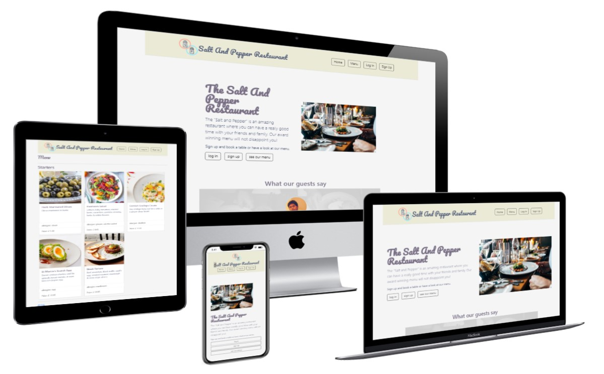

The "Salt and Pepper" website is a great tool to manage the restaurant easily through its database. Guests who log in, can reserve a table and manage their bookings or even write a review, which after it has been approved by the owner, will be shown on the landing page. The owner can easily see and manage all reservations. He also can quickly update or expand the menu (*pictures, prices, allergies, and descriptions*).

*Click on the link to the* [Salt and Pepper](https://salt-and-pepper-manager.herokuapp.com/) *live website*.

  

*mockup was generated with [techsini.com](https://techsini.com/multi-mockup/index.php)*

---

## Overview

1. [features](#1-features)
2. [technologies](#2-technologies)
3. [development](#3-development)
4. [testing](#4-testing)
5. [deployment](#6-deployment)
7. [credits](#7-credits)

---

[back to overview](#overview)

## 1. Features

### Main Features

#### 1. table reservation :

- the user can from within the app ...
  - **C**reate a table reservation
  - **R**ead his/her table reservation and see all available tables
  - **U**pdate his/her table reservation
  - **D**elete his/her table reservation  
  
  *Click on the link to see a demonstration of the feature:* [reserving a table](assets/doc/images/booking_table_600.gif)

#### 2. menu creation :

- the owner can as administrator ...
  - **C**reate a new menu item (_Name, description, allergies, price, image*_)  
  
    (* *pictures can only be uploaded as cloudinary link*)
  
  - **R**ead the menu
  - **U**pdate the menu
  - **D**elete menu items  
  
  *Click on the link to see a demonstration of the feature:* [create a menu](assets/doc/images/create_menu_600.gif)

### Minor Features

- guests can **write a review**, which is shown on the home page after the administrator has approved it

​		*Click on the link to see a demonstration of the feature:* [write a review](assets/doc/images/create_review_600.gif)  

- guest can **upload/change his profile picture**  

​		*Click on the link to see a demonstration of the feature:* [upload/ change profile picture](assets/doc/images/profile_picture_600.gif)  

- guests can use the side from their **mobile phone**  
- the **password can be reset** through a link received by email

### Planned Features  

- the user can:
  - leave a like on their favorite dish  
  - book a menu with their reservation
  - receive a reminder for their reservation  
  - not reserve a table that is before the current time
- the owner can:
  - keep a database about his guests to keep them up to date

---

[back to overview](#overview)

## 2. Technologies

#### The following technologies have been used for the project:

-  **HTML** *to give structure to the page and "mark" the content*
-  **CSS** & **Bootstrap** *to style the content and the page*  
-  **JavaScript** *to implement logic*  
-   **Python** & **Django** *for the "backend"*  
-  **Git** *for version control*  
-  **GitHub** *to store the project*  
-  **Cloudinary** *to store images online*  
-  **Gunicorn** *as Python Web Server Gateway Interface*
-  **Heroku** *to serve the project online*  
-  **PostgreSQL** *as database engine*

---

[back to overview](#overview)

## 3. Development

- agile (_see GitHub user stories and milestones_)  
- Please, follow this link to the [UX](assets/doc/doc_ux.md)

---

[back to overview](#overview)

## 4. Testing

- w3c markup validator (_HTML_)
- w3c css validator (_CSS_)
- Jest (_JavaScript_)
- unit tests (_Python_)
- Lighthouse (_website performance_)

### Known Bugs

- the user can book a table for a time slot which has already passed

---

[back to overview](#overview)

## 6. Deployment

---

[back to overview](#overview)

## 7. Credits

---

## TODO List

[] prevent the user from booking a table at a time which has already passed  
[] add confirmation when new booking has been place  
[] create and add logo
[] add location (_map_)  
[] add opening times and contact details  
[] add comments from costumers  
[] add gallery of restaurant
