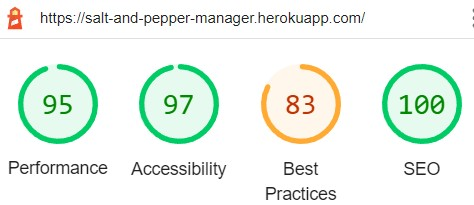
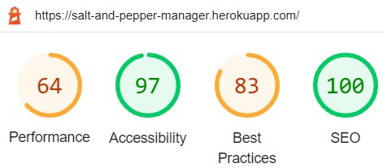

# Testing

## **HTML**  

 Nu Html Checker (*[https://validator.w3.org/nu/](https://validator.w3.org/nu/)*)  

Some errors were found, please the read explanation.

| page                                               | link to the test                                             | result                                                       |
| -------------------------------------------------- | ------------------------------------------------------------ | ------------------------------------------------------------ |
| home                                               | [link to the test](https://validator.w3.org/nu/?doc=https%3A%2F%2Fsalt-and-pepper-manager.herokuapp.com%2F) | No errors or warnings to show.                               |
| menu                                               | [link to the test](https://validator.w3.org/nu/?doc=https%3A%2F%2Fsalt-and-pepper-manager.herokuapp.com%2Fmenu%2F) | No errors or warnings to show.                               |
| login                                              | [link to the test](https://validator.w3.org/nu/?doc=https%3A%2F%2Fsalt-and-pepper-manager.herokuapp.com%2Faccounts%2Flogin%2F) | No errors or warnings to show.                               |
| signup                                             | [link to the test](https://validator.w3.org/nu/?doc=https%3A%2F%2Fsalt-and-pepper-manager.herokuapp.com%2Faccounts%2Fsignup%2F) | **Error :** **Element [`ul`](https://html.spec.whatwg.org/multipage/#the-ul-element) not allowed as child of element [`small`](https://html.spec.whatwg.org/multipage/#the-small-element) in this context. (Suppressing further errors from this subtree.)**   **Explanation :** The error is part of "Crispy" form, which is internal and I can not change from the outside. |
| change_password                                    | [link to the test](https://validator.w3.org/nu/?doc=https%3A%2F%2Fsalt-and-pepper-manager.herokuapp.com%2Faccounts%2Fpassword_change%2F) | No errors or warnings to show.                               |
| user_settings (*Change Your Profile Picture*) | [link to the test](https://validator.w3.org/nu/?doc=https%3A%2F%2Fsalt-and-pepper-manager.herokuapp.com%2Faccounts%2F) | No errors or warnings to show.                               |
| comments (*Write A Review*)                   | html copied into validator                                   | **Error 1 :** can not validate inherited HTML from base html **Error 2 :** dose not recognize Django template tag with date time **Error 3 :** Duplicate ID, but only one of the ids is used at a time, depending on the screen with |
| bookings                                           | html copied into validator                                   | **Error 1 :** can not validate inherited HTML from base html **Error 2 :** dose not recognize Django template tag with date time  |

## CSS  

W3C CSS Validation Service [jigsaw.w3.org/css-validator/](https://jigsaw.w3.org/css-validator/)  

- **No Error Found!** 
- **218 Warnings** 

- The document validates as [CSS level 3 + SVG](http://www.w3.org/Style/CSS/current-work.html) !   [link to test result](https://jigsaw.w3.org/css-validator/validator?uri=https%3A%2F%2Fsalt-and-pepper-manager.herokuapp.com%2F&profile=css3svg&usermedium=all&warning=1&vextwarning=&lang=en)

## Python PEP8  

Pylint was used in vscode to check PEP8 convention, which returned no errors.

## Lighthouse  

- desktop test result :  

  

- mobile test result :

  
