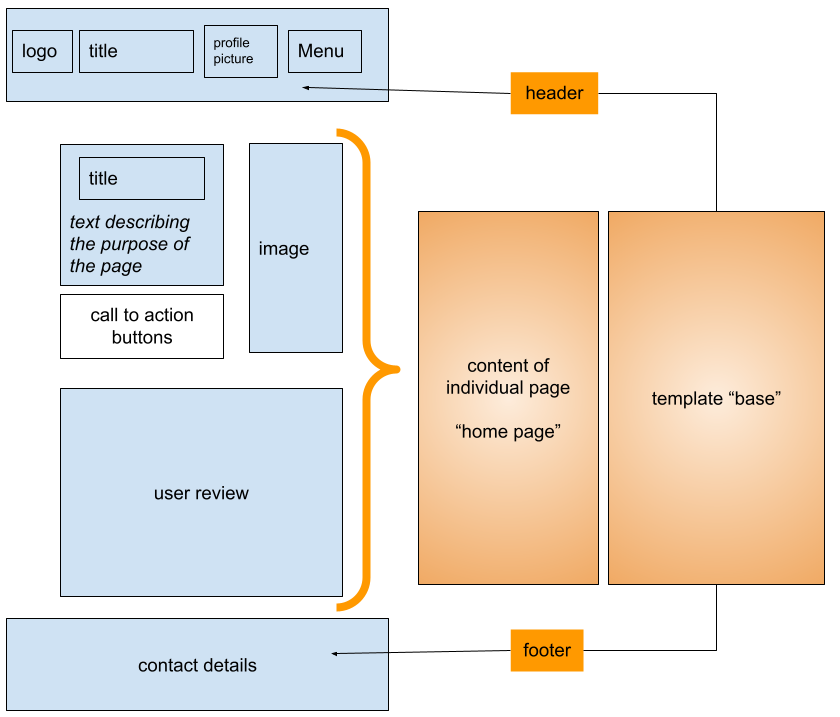
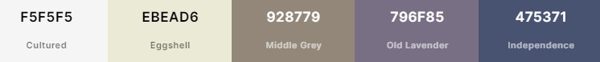

# User Experience (*UX*)  

## 1. The Strategy  

*Describes the idea of the project, what is its purpose, and who is it for.*

### What is the purpose of the product?

The purpose of the site is to make the **management of the restaurant** easier.  The following features are needed to achieve this goal:

1. a **booking system** to manage reservations  

2. an easy way to **update and change the menu** for the owner

3. the possibility to get **feedback** from the guests

### Who is the product for?

The audience for the website is:

1. the **owner** of the restaurant who wants to easily manage his restaurant

2. the **guests** of the restaurant who want to manage their reservations and share their feedback
3. **visitors** to the site who want to become guests  

## 2. User Stories  

The project was developed with an **agile** development style. *Click on the link to see which tasks have been allocated to the user stories on GitHub and in which iteration they appear. Please, note that some stories can be owner- or user- stories. To keep the document concise, they have been listed only once.*

### As the Owner, I can ...

- *present my restaurant to guests* **, so that ...**  
  - *they know about it.*  
- *update and change the menu* **, so that ...**  
  - *I can react and stay flexible.*
- *display the guest's name on the site* **, so that ...**  
  - *the site feels more personal to them.*  
- *give the user the chance to set a profile picture* **, so that ...**  
  - *they can better identify themselves with the site.*  
- *contact my guests* **, so that ...**  
  - *they can receive special promotions or I can inform them about changes.* 
- *change the bookings of my guests* **, so that ...**  
  - *I can react to unforeseen circumstances.* 
- *approve or delete the reviews from my guests* **, so that ...**  
  - *I can take action against inappropriate content.*  
- *access quickly the admin settings* **, so that ...**  
  - *I can apply changes quickly*  

### As a User, I can ...

- *easily see when and how many tables are available* **, so that ...**  
  - I don't lose too much time booking a table.*  
- *place a reservation in a few steps* **, so that ...**  
  - *I don't lose too much time or make a mistake*  
- *see my reservation* **, so that ...**  
  - *I remember.*  
- *cancel my booking easily* **, so that ...**  
  - *the restaurant can take other guests instead.*  
- *reset my password* **, so that ...**  
  - *I can log in again if I forget my password.*  
- *easily navigate the page* **, so that ...**  
  - *so that I find quickly all relevant information.*  

## 3. The Scope

*Contains the features which are based on the "user stories" that are implemented in this release.*   

### Main Features:  

1. ##### table reservation:  

   [see demonstration: table reservation](https://github.com/Zolske/salt-and-pepper-manager/blob/main/assets/doc/images/booking_table_600.gif)  

   - the information is stored in a database table that has **CRUD** functionality:  
     - **c**reate: tables can be reserved (*a new record in the database is created*)  
     - **r**ead: the reservation and the available tables can be viewed (*read from the database*)  
     - **u**pdate: reservations can be amended (*update record in the database*)  
     - **d**elete: reservations can be deleted (*delete record from database*)  
   - the layout is intuitive and easy to understand for first-time users (*4 clicks to complete the reservation*)  
   - contains logic to prevent false data input:  
     - there can be no booking date that is before today
     - it is not possible to book more tables than the ones which are available at the time slot
   - the database table updates itself automatically:
     - passed days are deleted from the database table  
     - the database table generates by default 10 available tables for each time slot and the current week + 7 weeks after  
   - there is an "available table view" which is based on the database table, so the user can see the availability quickly  
   - the owner can see on the admin panel which reservation belongs to which guest  
     - owner can contact the guest because he can see their email address in the admin panel
     - **note**, guests can not delete their account by themself, only the owner can, if he deletes a guest which has a booking then he needs to return the available table manually on the admin panel to the "available tables" table

2. #### menu creation:  

   [see demonstration: create a menu](https://github.com/Zolske/salt-and-pepper-manager/blob/main/assets/doc/images/create_menu_600.gif)  

   - the owner can from the administrator panel **c**reate **r**ead, **u**pdate, and **d**elete new menu items  
   - there are 5 components of each dish (*name, picture, description allergies, price*) which can be changed individually (**note**, that pictures can be only implemented as a link from sites like cloudinary)  

3. #### user feedback:  

   [see demonstration: write a review](https://github.com/Zolske/salt-and-pepper-manager/blob/main/assets/doc/images/create_review_600.gif)  

   - guests can write a review from within the app  
     - after the administrator has approved it, it is shown on the home page
     - entry is limited to 340 characters to protect the layout from "overflow"
     - reviews on the home page change automatically to the next by themself
     - user can see his own reviews but not delete them (only the admin can)  
     - reviews are not deleted when the guests are deleted (*reviews are needed even after guests have left*)
     - guests can not amend comments (*otherwise they could change its content and the administrator would need to approve it again*)  

### Minor Features  

- guest can **upload/change their profile picture**  [see demonstration: profile picture](https://github.com/Zolske/salt-and-pepper-manager/blob/main/assets/doc/images/profile_picture_600.gif)  
- guests can use the side from their **mobile phone**  
- the **password can be reset** through a link received by email  
- only the admin has an additional **link** in his menu that takes him to **the admin panel** 

### Planned Features 

*Maybe implemented in future releases.*  

- the user can:
  - leave a like on their favorite dish
  - book a menu with their reservation
  - receive a reminder for their reservation
  - not reserve a table that is before the current time  
  - when amending a reservation, the tables from the amended reservation should be returned to the total of the available tables (*at the moment the guest needs to cancel the reservation to access all possible tables and not just apart from the amendment*)
- the owner can:
  - tables should be returned automatically when a guest is deleted and not manually by the owner  

## 4. The Structure

*Describes the logic and the relational database model.*  

#### database model

  

(*the database model has been created from the actual database via a tool, you can find [the link to the doc here](graph_models.md)*)

##### 1. APP (appacounts) / MODEL (CustomUser) : 

- the "CustomUser" model inhered from the **AbstractUser** model and handles ...  
  - account set up and different roles (*admin or user*)  
  - a field for **profile_picture** has been added which contains an URL link (*as text*) to the user profile stored on an external host like cloudinary  

##### 2. APP (appbooking) / MODEL (User_Bookings)  

- is used to store information regarding bookings and contains the information for the user reservations (user, date, time slot, how many tables)  
  - **booked_name** is a foreign key to **user id**, the record gets deleted if the user gets deleted  
  - Python view functions are used to update the **Available_Table** model (*+ or - the available tables*)
    (**note** *, the available tables are not returned if a user had booked tables when he was deleted, it must be done manually by the owner in the admin panel*)  

##### 3. APP (appbooking) / MODEL (Available_Tables)  

- is used to store information regarding available tables and contains the information of the date, and how many tables are available at each time slot (*default is 10*)  
  - Python view functions are used to ...  
    - delete all days which are before today
    - generate new days for the current week + 7 weeks after (*if they do not exist as booking*)
    - the function is called every time a user is opening the **bookings**  page  

##### 4. APP (appcomments) / MODEL (Comments)  

- is used to store the comments and contains the information of ... 
  - the **user id** who wrote the comment as a foreign key (*comment gets not deleted when the user gets deleted*)  
  - if the comment was **approved** by the admin (*default is false*)  
  - the **date** which the guest chooses (*can not be after today but any other day, set as form validation in HTML*) the review is based on
  - **name** the "user id" and is filled in automatically when the user sends the form  
  - **picture** is the link to the external picture (*can be cloudinary*) which the user had for his user profile when he wrote the comment  
  - **rating** is between 1 and 5, and is what the user chooses when he writes the review  
  - **review** is the text the user enters when writing the review (*is limited to 340 characters on the html from*)  

##### 5. APP (appmenu) / MODEL (MenuMain)  

- there are 4 more models which follow the same pattern (*MenuDrinks, MenuDesser, MenuMain, ManuStarter*)  
- is used to create the menu and contains the information of ...
  - **allergies** is a text field that describes the dish that has allergens  
  - **alt** is for the image which is used on the html page as an alternative description if the image can not be loaded or for screen readers  
  - **description** holds the text for the dish (*or drink*)  
  - **image** is the external link to the image as characters (*can be cloudinary*)  
  - **price** displays the price which can have max 3 digits before the dot and 2 after  

#### site menu structure  

Every HTML page inherits from a "base template" that contains the header and the footer.  

Template literals are used to show the link to the admin site in the navbar only if the admin is logged in.  

The "user profile picture" is only shown if the user has one.  

**ADD FLOWCHART**

# 5. The Skeleton  

#### wireframe  

## 6. The Surface

### color scheme

  

White has been chosen as the background to symbolize a white table cloth. The other colors are chosen because they complement the background color nicely and give a good contrast.  

#### typography  

The font for the headings is "Pacifico", which I choose because it is simplistic and relaxed.  You can read more about the Google font under this link [google font Pacifico](https://fonts.google.com/specimen/Pacifico?query=pacif#glyphs)  

#### Navigation  

Is kept simple so the user can find things easily.

- booking a table can be done in easy and quick 4 steps

